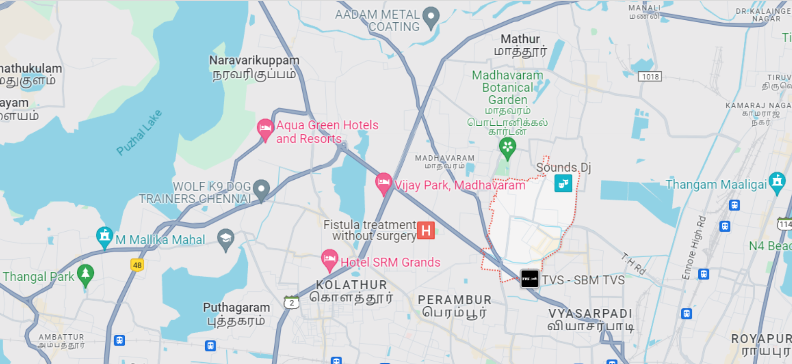
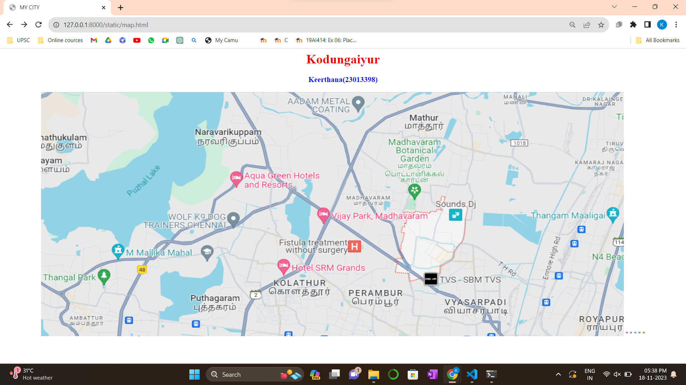
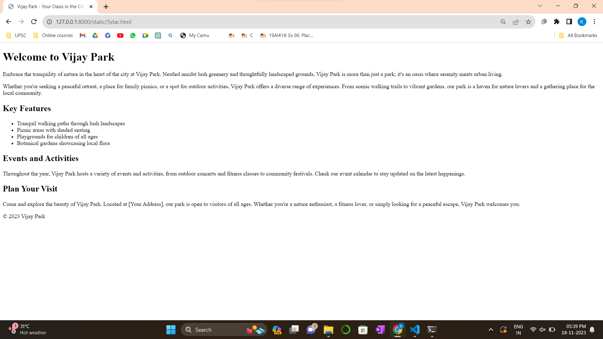
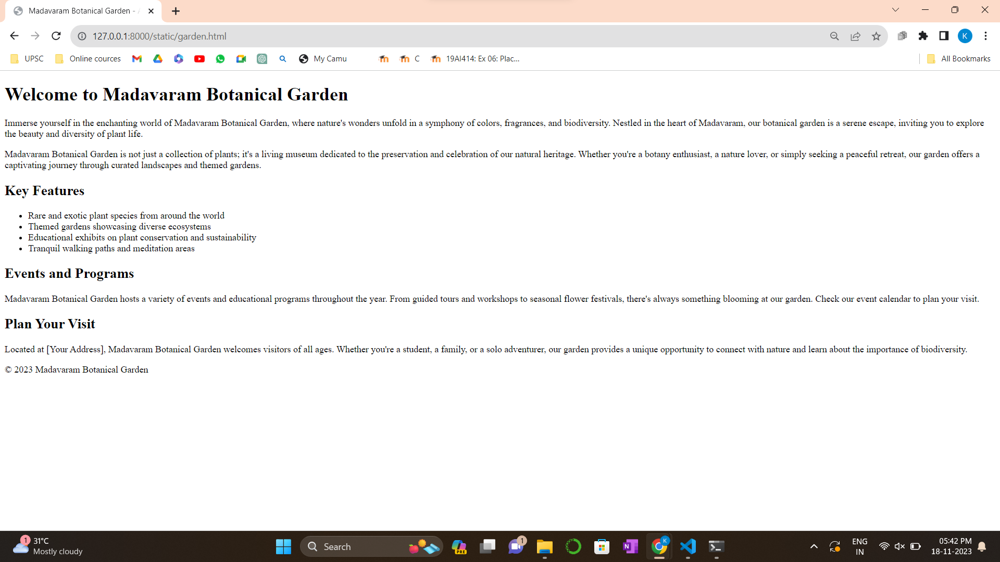

# Ex-06-Places Around Me
# Aim:
To develop a website to display details about the places around my house.

# Design Steps:
## Step 1
Fork and Clone the GitHub repository.
## Step 2
Create a new Django project.
## Step 3
 Add a view and template to your Django project
## Step 4
Take screenshots of places around your house using Google Maps.


## Step 5
Identify a minimum of five different locations and mark them using image maps.

## Step 6
 Develop a webpage(minimum of 50 words) for each location and link it to the image region.
## Step 7
Mention your domain URL and the GitHub Repo URL in the submission text and attach the lab report pdf.

# Code:
```
<html>
<head>
<title>MY CITY</title>
</head>
</html>
<body>
<h1 align="center">
<font color="red"><b>Kodungaiyur</b></font>
</h1>
<h3 align="center">
<font color="blue"><b>Keerthana(23013398)</b></font>    
</h3>
<center>

<map name="MYCITY">
<area shape="rect" coords="700,250,900,900" href="5star.html" title="Vijay Park">" 
<area shape="rect" coords="600,150,800,800" href="resort.html" title="Aqua Green Hotels and Resorts">" 
<area shape="rect" coords="500,100,500,600" href="garden.html" title="Madhavaram Botanical Garden">" 
<area shape="rect" coords="400,90,300,200" href="hotel.html" title="Hotel SRM Grands">" 
<area shape="rect" coords="300,80,700,900" href="park.html" title="Thangal Park">"  
</map>
</center>
</body>

<!DOCTYPE html>
<html lang="en">
<head>
  <meta charset="UTF-8">
  <meta name="viewport" content="width=device-width, initial-scale=1.0">
  <title>Madavaram Botanical Garden - A Haven of Biodiversity</title>
</head>
<body>

  <header>
    <h1>Welcome to Madavaram Botanical Garden</h1>
  </header>

  <section id="introduction">
    <p>
      Immerse yourself in the enchanting world of Madavaram Botanical Garden, where nature's wonders unfold in a symphony of colors, fragrances, and biodiversity. Nestled in the heart of Madavaram, our botanical garden is a serene escape, inviting you to explore the beauty and diversity of plant life.
    </p>
    <p>
      Madavaram Botanical Garden is not just a collection of plants; it's a living museum dedicated to the preservation and celebration of our natural heritage. Whether you're a botany enthusiast, a nature lover, or simply seeking a peaceful retreat, our garden offers a captivating journey through curated landscapes and themed gardens.
    </p>
  </section>

  <section id="key-features">
    <h2>Key Features</h2>
    <ul>
      <li>Rare and exotic plant species from around the world</li>
      <li>Themed gardens showcasing diverse ecosystems</li>
      <li>Educational exhibits on plant conservation and sustainability</li>
      <li>Tranquil walking paths and meditation areas</li>
      <!-- Add more key features as needed -->
    </ul>
  </section>

  <section id="events">
    <h2>Events and Programs</h2>
    <p>
      Madavaram Botanical Garden hosts a variety of events and educational programs throughout the year. From guided tours and workshops to seasonal flower festivals, there's always something blooming at our garden. Check our event calendar to plan your visit.
    </p>
  </section>

  <section id="visit-us">
    <h2>Plan Your Visit</h2>
    <p>
      Located at [Your Address], Madavaram Botanical Garden welcomes visitors of all ages. Whether you're a student, a family, or a solo adventurer, our garden provides a unique opportunity to connect with nature and learn about the importance of biodiversity.
    </p>
  </section>

  <footer>
    <p>&copy; 2023 Madavaram Botanical Garden</p>
  </footer>

</body>
</html>


<!DOCTYPE html>
<html lang="en">
<head>
  <meta charset="UTF-8">
  <meta name="viewport" content="width=device-width, initial-scale=1.0">
  <title>Vijay Park - Your Oasis in the City</title>
</head>
<body>

  <header>
    <h1>Welcome to Vijay Park</h1>
  </header>

  <section id="introduction">
    <p>
      Embrace the tranquility of nature in the heart of the city at Vijay Park. Nestled amidst lush greenery and thoughtfully landscaped grounds, Vijay Park is more than just a park; it's an oasis where serenity meets urban living.
    </p>
    <p>
      Whether you're seeking a peaceful retreat, a place for family picnics, or a spot for outdoor activities, Vijay Park offers a diverse range of experiences. From scenic walking trails to vibrant gardens, our park is a haven for nature lovers and a gathering place for the local community.
    </p>
  </section>

  <section id="key-features">
    <h2>Key Features</h2>
    <ul>
      <li>Tranquil walking paths through lush landscapes</li>
      <li>Picnic areas with shaded seating</li>
      <li>Playgrounds for children of all ages</li>
      <li>Botanical gardens showcasing local flora</li>
      <!-- Add more key features as needed -->
    </ul>
  </section>

  <section id="events">
    <h2>Events and Activities</h2>
    <p>
      Throughout the year, Vijay Park hosts a variety of events and activities, from outdoor concerts and fitness classes to community festivals. Check our event calendar to stay updated on the latest happenings.
    </p>
  </section>

  <section id="visit-us">
    <h2>Plan Your Visit</h2>
    <p>
      Come and explore the beauty of Vijay Park. Located at [Your Address], our park is open to visitors of all ages. Whether you're a nature enthusiast, a fitness lover, or simply looking for a peaceful escape, Vijay Park welcomes you.
    </p>
  </section>

  <footer>
    <p>&copy; 2023 Vijay Park</p>
  </footer>

</body>
</html>


<!DOCTYPE html>
<html lang="en">
<head>
  <meta charset="UTF-8">
  <meta name="viewport" content="width=device-width, initial-scale=1.0">
  <title>SRM Grand Hotel - Where Luxury Meets Hospitality</title>
</head>
<body>

  <header>
    <h1>Welcome to SRM Grand Hotel</h1>
  </header>

  <section id="introduction">
    <p>
      Experience unparalleled luxury and warm hospitality at SRM Grand Hotel, your gateway to a world of comfort and elegance. Conveniently located in the heart of [Your City], our hotel is designed to cater to the needs of both business and leisure travelers, providing a memorable stay that exceeds expectations.
    </p>
    <p>
      SRM Grand Hotel prides itself on offering a perfect blend of modern amenities and personalized service. Whether you're here for a business meeting, a special event, or a relaxing getaway, our dedicated staff is committed to ensuring your stay is seamless and enjoyable.
    </p>
  </section>

  <section id="key-features">
    <h2>Key Features</h2>
    <ul>
      <li>Luxurious and well-appointed rooms and suites</li>
      <li>On-site fine dining restaurants serving a variety of cuisines</li>
      <li>State-of-the-art conference and event facilities</li>
      <li>Relaxing spa and fitness center for wellness enthusiasts</li>
      <!-- Add more key features as needed -->
    </ul>
  </section>

  <section id="services">
    <h2>Our Services</h2>
    <p>
      At SRM Grand, we go beyond providing a place to stay. Our range of services includes concierge assistance, room service, and event planning to ensure every aspect of your visit is taken care of. Whether you're here for business or leisure, our goal is to make your stay memorable.
    </p>
  </section>

  <section id="book-now">
    <h2>Book Your Stay</h2>
    <p>
      Ready to experience the epitome of hospitality? Book your stay at SRM Grand Hotel today. Whether you're planning a business trip, a family vacation, or a special celebration, our team is here to make your stay exceptional.
    </p>
  </section>

  <footer>
    <p>&copy; 2023 SRM Grand Hotel</p>
  </footer>

</body>
</html>


<!DOCTYPE html>
<html lang="en">
<head>
  <meta charset="UTF-8">
  <meta name="viewport" content="width=device-width, initial-scale=1.0">
  <title>Thangal Park - Nature's Oasis in the City</title>
</head>
<body>

  <header>
    <h1>Welcome to Thangal Park</h1>
  </header>

  <section id="introduction">
    <p>
      Step into the serene embrace of nature at Thangal Park, an enchanting green space nestled in the heart of [Your City]. As a sanctuary of tranquility, Thangal Park offers a picturesque escape from the hustle and bustle of city life, inviting visitors to immerse themselves in the beauty of nature.
    </p>
    <p>
      Thangal Park is more than just a park; it's a haven for biodiversity, a recreational paradise, and a community gathering place. Whether you're seeking a peaceful stroll, a family picnic, or a place to connect with nature, our park provides a welcoming environment for all.
    </p>
  </section>

  <section id="key-features">
    <h2>Key Features</h2>
    <ul>
      <li>Tranquil walking trails amidst lush greenery</li>
      <li>Scenic ponds and bridges creating a serene atmosphere</li>
      <li>Children's play areas for family enjoyment</li>
      <li>Botanical gardens showcasing local flora and fauna</li>
      <!-- Add more key features as needed -->
    </ul>
  </section>

  <section id="events">
    <h2>Events and Activities</h2>
    <p>
      Thangal Park hosts a variety of events and activities throughout the year. From seasonal festivals and outdoor yoga sessions to nature walks and educational programs, there's always something happening amidst the beauty of the park. Check our event calendar for the latest updates.
    </p>
  </section>

  <section id="visit-us">
    <h2>Plan Your Visit</h2>
    <p>
      Located at [Your Address], Thangal Park is open to nature enthusiasts, families, and individuals alike. Whether you're looking for a quiet escape or a place to enjoy outdoor activities, we invite you to explore the natural wonders of Thangal Park.
    </p>
  </section>

  <footer>
    <p>&copy; 2023 Thangal Park</p>
  </footer>

</body>
</html>


<!DOCTYPE html>
<html lang="en">
<head>
  <meta charset="UTF-8">
  <meta name="viewport" content="width=device-width, initial-scale=1.0">
  <title>Aqua Hotel and Resorts - Where Luxury Meets the Sea</title>
</head>
<body>

  <header>
    <h1>Welcome to Aqua Hotel and Resorts</h1>
  </header>

  <section id="introduction">
    <p>
      Immerse yourself in the epitome of luxury and relaxation at Aqua Hotel and Resorts, a seaside haven designed to elevate your vacation experience. Nestled along the picturesque shoreline of [Your Destination], our resort offers a perfect blend of contemporary elegance, world-class amenities, and breathtaking views of the sea.
    </p>
    <p>
      At Aqua, we pride ourselves on providing more than just accommodation; we offer an escape to a world where tranquility meets indulgence. Whether you're seeking a romantic getaway, a family retreat, or a destination for special events, Aqua Hotel and Resorts promises an unforgettable stay by the sea.
    </p>
  </section>

  <section id="key-features">
    <h2>Key Features</h2>
    <ul>
      <li>Luxurious ocean-view rooms and suites</li>
      <li>Private beach access for guests</li>
      <li>Infinity pools and spa facilities for ultimate relaxation</li>
      <li>Fine dining restaurants with a focus on fresh, local cuisine</li>
      <!-- Add more key features as needed -->
    </ul>
  </section>

  <section id="services">
    <h2>Our Services</h2>
    <p>
      At Aqua Hotel and Resorts, our dedicated staff is committed to ensuring your every need is met. From personalized concierge services to event planning for special occasions, we strive to create an experience that exceeds your expectations. Your comfort and enjoyment are our top priorities.
    </p>
  </section>

  <section id="book-now">
    <h2>Book Your Coastal Getaway</h2>
    <p>
      Ready to unwind by the sea? Book your stay at Aqua Hotel and Resorts today and embark on a journey of relaxation and luxury. Whether you're lounging by the pool, indulging in gourmet cuisine, or strolling along the beach at sunset, Aqua promises a coastal escape like no other.
    </p>
  </section>

  <footer>
    <p>&copy; 2023 Aqua Hotel and Resorts</p>
  </footer>

</body>
</html>

```

# Output:







# Result:
Image map is succesfully created and executed.